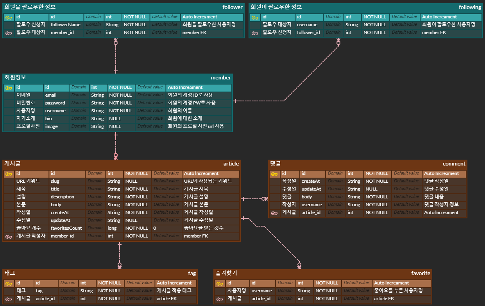

# DB ERD(Entity Relationship Diagram) 작성
기본적으로 프로젝트 수행전에 `ERD`를 작성해야 하지만, 요구 스펙이 이미 존재하는 프로젝트였기에 부득이하게 작성하지 못했다.
- 참고한 프로젝트 스펙 : [RealWorld](https://realworld-docs.netlify.app/docs/specs/backend-specs/endpoints)
- 해당 요구 스펙을 추가하던 중 `DB`를 좀 더 알아야 추가할 수 있는 스펙이 있어 추가 학습 후 `ERD`를 작성
## 작성한 ERD
  
  

## 엔티티
### 회원정보 - member
회원으로 등록된 사용자의 정보를 가지는 엔티티
- `id`: 엔티티의 `PK`로 `Null`이나 `중복 값`을 허용하지 않음
  - 추가됨에 따라 값이 1씩 증가함
- `email`: 회원 계정의 `ID`로 사용되는 `email 주소 형태`의 문자열, `필수 입력`
  - `Null`과 `중복`을 허용하지 않음
- `password`: 회원 계정의 `PW`로 사용되는 문자열, `필수 입력`
  - `Null`을 허용하지 않음
- `username`: 회원 계정의 `사용자명`으로 사용되는 문자열, `필수 입력`
  - `Null`과 `중복`을 허용하지 않음
- `bio`: `회원 소개`로 사용되는 문자열, `선택 입력`
- `image`: `회원 프로필 사진`으로 사용되는 문자열(url), `선택 입력`  
 

### 회원이 팔로우한 정보 - following
팔로우 신청자의 `id`와 팔로우 대상자의 `username`을 가지는 엔티티
- `id`: 엔티티의 `PK`로 `Null`이나 `중복 값`을 허용하지 않음
  - 추가됨에 따라 값이 1씩 증가함
- `username`: 회원이 팔로우한 `대상자`의 사용자명
- `follower_Id`: 팔로우를 신청한 회원의 `id`, `FK`로 사용
  - 하나의 회원은 팔로우한 사용자가 없거나, 한 명 또는 다수일 수 있음  
 

### 회원을 팔로우한 정보 - follower
팔로우 신청자의 `username`과 팔로우 대상자의 `id`를 가지는 엔티티
- `id`: 엔티티의 `PK`로 `Null`이나 `중복 값`을 허용하지 않음
    - 추가됨에 따라 값이 1씩 증가함
- `followerName`: 회원을 팔로우한 `신청자`의 사용자명
- `member_Id`: 팔로우 `대상자`의 `id`, `FK`로 사용
  - 하나의 회원을 팔로우하는 사용자가 없거나, 한 명 또는 다수일 수 있음  
 

### 게시글(기사) - article
게시글의 정보를 가지는 엔티티
- `id`: 엔티티의 `PK`로 `Null`이나 `중복 값`을 허용하지 않음
    - 추가됨에 따라 값이 1씩 증가함
- `slug`: `tile`의 문자를 소문자로 바꾼 문자열로 `Api 요청 url`에 사용
  - `tile` 값 변경 시, `slug` 값도 변경 문자열에 맞춰 변경
- `title`: 게시글 `제목`으로 사용되는 문자열, `필수 입력`
  - `Null`을 허용하지 않음
- `description`: 게시글 `설명`으로 사용되는 문자열, `필수 입력`
  - `Null`을 허용하지 않음
- `body`: 게시글 `본문`으로 사용되는 문자열, `필수 입력`
  - `Null`을 허용하지 않음
- `createAt`: 게시글 `작성일`로 사용되는 문자열
  - `Null`을 허용하지 않음
- `updateAt`: 게시글 `수정일`로 사용되는 문자열
- `favoritesCount`: 게시글이 `좋아요`를 받은 횟수, 기본 값은 `0`
  - `Null`을 허용하지 않음
- `member_Id`: 게시글을 작성한 회원의 `id`, `FK`로 사용
  - 하나의 회원은 작성한 게시글을 작성하지 않거나, 하나 또는 여러 개의 게시글을 작성 할 수 있음
> _슬러그(slug)란?_  
> 원래 신문이나 잡지 등에서 제목을 쓸 때, 중요한 의미를 포함하는 단어들로 제목을 작성하는 방법이다. 핵심 의미를 가지는 단어들을 조합하면 긴 제목을 간단 명료하게 표현 가능하다.  
> 특히, `검색엔진 최적화(Searching Engine, Optimization)`에 유용하게 사용되며, `URL`이 핵심 의미를 담고 있는 키워드를 사용하면 검색엔진에서 더 빨리, 더 정확하게 검색결과를 얻는데 도움이 된다고 한다.  
> [참고 정보](https://ivynet.co.kr/what-is-slug/)

 

### 즐겨찾기 - favorite
- `id`: 엔티티의 `PK`로 `Null`이나 `중복 값`을 허용하지 않음
    - 추가됨에 따라 값이 1씩 증가함
- `username`: 게시글에 `좋아요`를 누른 사용자의 `사용자명`
- `article_Id`: `좋아요`를 받은 게시글의 `id`, `FK`로 사용
  - 하나의 게시글은 사용자에게 `좋아요`를 받을 수 없거나, 하나 또는 다수의 사용자에게 `좋아요`를 받을 수 있음  
 

### 태그 - tag
- `id`: 엔티티의 `PK`로 `Null`이나 `중복 값`을 허용하지 않음
  - 추가됨에 따라 값이 1씩 증가함
- `tag`: 게시글에 적용된 `태그명`
- `article_id`: `태그`를 적용한 게시글의 `id`, `FK`로 사용
  - 하나의 게시글은 `태그`가 없거나, 하나 또는 다수의 `태그`를 가질 수 있음  
 

### 댓글 - comment
- `id`: 엔티티의 `PK`로 `Null`이나 `중복 값`을 허용하지 않음
  - 추가됨에 따라 값이 1씩 증가함
- `createAt`: 댓글 `작성일`로 사용되는 문자열
  - `Null`을 허용하지 않음
- `updateAt`: 댓글 `수정일`로 사용되는 문자열
- `body`: 작성한 댓글의 `본문`으로 사용되는 문자열, `필수 입력`
  - `Null`을 허용하지 않음
- `username`: 댓글을 작성한 `사용자`의 이름으로 사용되는 문자열, `필수 입력`
  - `Null`을 허용하지 않음
- `article_id`: `댓글`을 작성한 게시글의 `id`, `FK`로 사용
  - 하나의 게시글은 `댓글`이 없거나, 하나 또는 다수의 `댓글`을 가질 수 있음