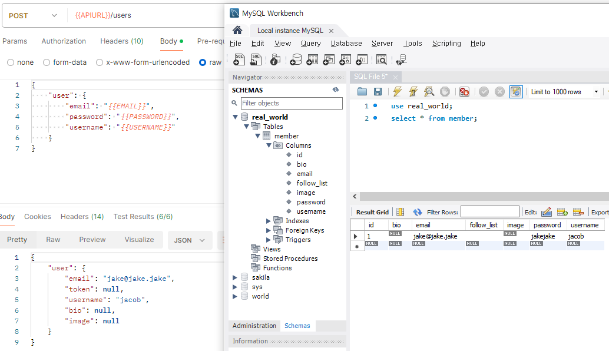
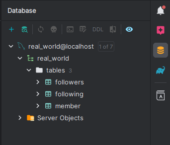

# 개발에 적용하기 위해 학습한 내용 정리
## Domain
도메인(domain) = 시스템이 구현해야하는 `핵심 비즈니스 업무 영역`
- 향후 다른 기술을 사용해도 `domain`은 그대로 유지할 수 있도록 해야 함
- 즉, 기술은 `domain`을 의존하고 `domain`은 기술에 의존하지 않도록 설계해야 함  
<br/><br/>

## Lombok
### @Data
`종합 선물 세트(@Getter, @Setter, @ToString, @EqualsAndHashCode, @RequiredArgsConstructor)`
- `POJO(Plain Old Java Objects)` & `bean` 과 관련된 모든 `재사용 가능 코드(boilerplate)`를 생성
- ex) `getter` `setter` `toString` `equals`  
<br/>

### @RequiredArgsConstructor
`생성자 주입`을 임의의 코드 없이 자동으로 설정해주는 어노테이션
- 초기화 되지 않은 `final 필드`나 `@NonNull`이 붙은 필드에 대해 생성자를 생성해 줌
- 새로운 필드 추가 시, 다시 생성자를 만들어서 관리하는 번거로움을 없애 줌  
<br/>

### @NoArgsConstructor
파라미터가 없는 `기본 생성자`를 생성해줌
- 클래스에 명시적으로 선언된 생성자가 없어도 인스턴스를 생성할 수 있음  
<br/>

### @AllArgsConstructor
모든 필드 값을 파라미터로 받는 생성자를 생성해줌
- `클래스의 모든 필드`를 한 번에 초기화 할 수 있음  
<br/>

### @Builder
자동으로 `Builder Pattern`에 맞게 `builder 클래스`를 생성해줌
- `Builder Pattern`: 객체 생성을 위한 방법 중 하나
  - 객체 생성시 여러 필드가 존재할 경우 나타나는 여러 문제들을 해결하기 위해 등장  
<br/>

### @Builder.Default
빌더 패턴을 통해 객체를 생성 시 특정(지정한) 값으로 초기화 할 수 있게 해줌
```java
@Builder.Default
private String follow = "이 문장을 초기화 값으로";
```
위처럼 작성 후 객체를 생성시 `followList = "이 문장을 초기화 값으로"`으로 초기화해 반환 받을 수 있음  
<br/>

### @Component
해당 애노테이션을 사용한 클래스가 스프링에서 객체로 만들어 관리하는 대상임을 명시
- 해당 애노테이션이 존재하는 클래스들을 빈으로 관리  
<br/>

### @ToString
`toString()`을 자동으로 생성해줌
- 설정 값으로 `exclude`를 사용하면 설정한 필드를 `toString()` 결과에서 제외시킴
  - ex) `@ToString(exclude = "필드명")`  
<br/>

### @NonNull
메서드의 `파라미터(매개변수)`나 필드의 `멤버변수`에 지정하여 `null 검사`를 삽입해 `null 검증`이 가능하도록 해줌
- 지정한 값이 `null`을 가지고 있다면 `NullPointerException` 발생
  - 메서드의 경우 : 메서드 본문 시작전에 `null 검사`를 삽입해 지정한 파라미터의 `null` 검증을 수행
  - 필드의 경우 : 지정한 멤버 변수를 포함한 모든 생성자에 대해서 `null 검사`를 삽입하고 검증을 수행  
<br/><br/>

## Annotation
### @NotEmpty
`null`과 `""(빈 문자열)`를  둘 다 허용하지 않음
- 단, `" "(공백 문자열)`은 허용
- `Bean Validation`에서 제공하는 `표준 Validation`  
<br/>

### @Entity
`JPA`가 사용하는 객체라는 `인식표`, 해당 애노테이션이 있어야 `JPA`가 인식 가능함
- 해당 애노테이션이 붙은 객체를 `JPA`에선 엔티티라 함  
<br/>

### @Id
테이블의 `PK(Primary Key = 기본 키)`와 해당 `필드`를 매핑함  
<br/>

### @GeneratedValue
`기본 키(Primary Key)`를 자동으로 생성해줌
- 속성 값으로 `strategy`가 있는데 이를 통해 `자동 생성 전략`을 지정할 수 있음
  - `IDENTITY`: 기본 키 생성을 `데이터베이스에 위임`하는 전략
  - `SEQUENCE`: `데이터베이스 시퀀스`를 사용해 기본 키를 생성
  - `TABLE`: 시퀀스 대신 `테이블`을 사용할 뿐 `SEQUENCE`전략과 동작 방식이 같음  
<br/>

### @Service
서비스 레이어 지정 어노테이션
- 비즈니스 로직을 수행하는 서비스 레이어 클래스임을 나타냄
- 캡슐화 없이 모델 내에서 단독 인터페이스로서 제공되는 동작을 의미  
<br/>

### @Configuration
설정 파일을 생성 or Bean 을 등록하기 위한 애노테이션
- 가시적으로 설정파일 인지 또는 Bean 등록을 할지 알 수 있음  
<br/>

### @RestController
`Bean`의 타입을 `RestController`로 설정
- 해당 컨트롤러는 사용자 요청을 받아 `json 값`으로 응답을 주겠다고 명시함
- `@Controller`와 다르게 리턴 값에 자동으로 `@ResponseBdoy`가 붙어 별도로 명시하지 않아도 됨  
<br/>

### @ResponseStatus
`HTTP 상태 코드 지정`에 사용되는 애노테이션
- Spring 에서 기본적으로 요청에 대한 응답이 성공적으로 이루어지면 `HTTP 200 (OK)` 응답을 제공
- 해당 애노테이션을 사용하면 상황에 맞게 필요한 상태 코드를 지정 할 수 있음
- 또한 오류를 알리고 싶다면 `reason` 을 통해 오류 메시지를 제공할 수 있음
  - Spring 은 지정한 메서드가 성공적으로 완료 될 때만 `@ResponseStatus`를 사용하므로 적합하지 않아 보임
  - 오류 메시지로 메시지를 알릴 뿐 따로 예외를 던지지 않음
- 예외를 `HTTP 응답 상태`로 변환하기 위해서는 아래의 방법을 사용하도록 하자
  - `@ExceptionHandler` 사용
  - `@ControllerAdvice` 사용
  - `Exception 클래스` 지정  
<br/>

### @JsonInclude
해당 `annotation`을 적용한 `속성의 값(필드, 메서드, 생성자 매개변수에 사용되는 경우)` 또는 클래스의 `모든 속성이 직렬화 되는 시기`를 나타내는 데 사용함
- `annotation` 적용이 없다면 해당 값을 항상 포함되겠지만 적용한다면 옵션을 적용해 이를 지정할 수 있음
- 해당 `annotation`을 적용하게 되면 `Java 객체`에서는 해당 속성 값이 확인되나 `JSON 출력`에서는 `적용된 옵션`에 따라 확인되거나 되지 않음
- 적용 가능한 옵션
  - `NON_NULL`
    - `null` 제외
  - `NON_EMPTY`
    - `null` 값이 있는 속성 또는 비어있는 값으로 간주되는 속성을 포함하지 않음
    - `비어있는 값`의 정의는 데이터 유형에 따라 다름
      - `Null` 값, `absent` 값 -> `NON_NULL`과 `NON_ABSENT` 옵션에서 제외하는 값 포함
      - `Collection, Map`의 `isEmpty()`를 호출해 `true`인 경우
      - `Java Array`의 길이가 `0`인 경우
      - `Java String`의 길이가 `0`인 경우  
<br/><br/>

## JPA
### jpa.hibernate.ddl-auto
`JPA`의 `테이블 생성 전략`을 의미함, `Entity`클래스를 대상으로 DDL 쿼리 실행 여부 및 실행 쿼리를 선택 가능
- `none`: 테이블 생성 전략을 사용하지 않음 (보통의 운영 환경에서 권장되는 옵션)
- `create`: 기본 테이블 제거 후 테이블 재생성
- `creat-drop`: 에플리케이션 졸료 시점에 기본 테이블 제거 후 테이블 재생성
- `update`: 기존 테이블 구조 유지, 신규 추가 컬럼(멤버)만 테이블에 반영
  - 기존 컬럼은 속성이 변경되도 테이블레 반영되지 않음
- `validate`: DDL 쿼리를 실행하지 않음, 온전하게 엔티티와 테이블이 저장 매핑 되었는지 확인
  - `none`과 함께 운영 환경에서 권장되는 옵션  
<br/><br/>

## Querydsl
### Spring Boot 버전별 gradle 설정
1. Spring Boot 3.0 이하
```
dependencies {

  implementation 'com.querydsl:querydsl-jpa'
  annotationProcessor "com.querydsl:querydsl-apt:${dependencyManagement.importedProperties['querydsl.version']}:jpa"
  
  annotationProcessor "jakarta.annotation:jakarta.annotation-api"
  annotationProcessor "jakarta.persistence:jakarta.persistence-api"

}
```
2. Spring Boot 3.0 이상
```
dependencies {

  implementation 'com.querydsl:querydsl-jpa:5.0.0:jakarta'
  annotationProcessor "com.querydsl:querydsl-apt:${dependencyManagement.importedProperties['querydsl.version']}:jakarta"
  
  annotationProcessor "jakarta.annotation:jakarta.annotation-api"
  annotationProcessor "jakarta.persistence:jakarta.persistence-api"

}
```  
<br/><br/>

## Spring Framework 6.1 이상 파라미터 인식 오류
스프링 프레임 워크 6.X - 파라미터 이름 인식 설정
- 참고 : [Spring Framework 6.2](https://github.com/spring-projects/spring-framework/wiki/Upgrading-to-Spring-Framework-6.x#parameter-name-retention)
- 원인 : `LocalVariableTableParameterNameDiscoverer` 6.1에서 제거
- 해결
  - `gradle`에 아래의 코드 추가 (Groovy DSL)
  ```
  trasks.withType(JavaCompile).configureEach {
      options.compilerArgs.add("-parameters")
  }
  ```
  - `IDE` 수동 구성
    - `Settings` → `Build, Execution, Deployment` → `Compiler` → `Java Compiler` → `Additional command line parameters`에  `-parameters`를 추가
  - `주의!`: 이미 실행되어 `out` 패키지가 생성된 프로젝트라면 해당 패키지 삭제하고  `IntelliJ` 재실행 한 후, 프로젝트를 실행하면 위의 설정이 정상 적용 됨  
<br/><br/>

## Map 보다 DTO 클래스를 사용해야 하는 이유
많은 개발자들이 `"Map을 사용하면 너무 많은 단점들을 가지기에 DTO 클래스를 사용해야 한다."`라고 말한다.
- Map 사용 시 단점
1. 컴파일 에러를 유발할 수 없음
   - 흔히 `개발자에게 최고의 에러는 컴파일 에러`라고 말한다.
   - 컴파일 단계에서 빠르게 에러를 인지할 수 있기 때문이다.
   - 그렇기에 컴파일 에러 발생이 없다는 것은 유지보수에 어려움을 가져온다.
2. `String` 타입의 `key`를 사용해 문제 발생 여지가 다분함
   - `key` 값에 오타가 있더라도 오류 발생이 없어 불필요한 시간낭비를 초래할 수 있음
3. 떨어지는 가독성
   - `Map<String, Object>`를 보면 어떤 `key` 값을 받고 어떤 `value` 값을 받는지 파악하기 쉽지 않다.
   - 만약 `Map` 안에 또 다른 `Map`이 있다면 이러한 불편함은 더 심각해짐
   - 또한 `Map`이 파라미터로 넘어가는 경우도 가독성 문제가 심각해짐
   - 이는 코드를 이해함에 있어 `불필요한 코드 리딩 시간`을 늘리게 됨
4. 타입 캐스트 비용 발생
   - 꺼내는 데이터가 많을 수록 비용이 증가하고 이는 불필요한 비용을 늘리는 꼴
5. 불변성을 확보 불가능
   - 자칫 불변성을 유지해야하는 데이터가 실수로 사라지거나 변경되는 불상사가 발생할 수 있음  
<br/><br/>

## Authentication(인증)과 Authorization(권한부여)
- `Authentication`: 로그인 처럼 사용자 또는 프로세스의 신원을 확인하는 프로세스
- `Authorization`: 누가 무엇을 할 수 있는지 결정하는 규칙  
<br/><br/>

## Spring Boot Security + JWT 동작
1. `클라이언트 -> 서버`: ID/PW 정보로 로그인 요청
2. `클라이언트 <- 서버`: 로그인 정보 검증 후 `AccessToken + RefreshToken`을 발급
3. `클라이언트 -> 서버`: 요청 헤더에 발급 받은 `AccessToken`을 포함해 API 요청
   - `AccessToken` 검증 통과 시
     1. `클라이언트 <- 서버`: 요청된 API 수행 후 결과 반환
   - `AccessToken` 만료 시
     1. `클라이언트 <- 서버`: `AccessToken` 만료 응답
     2. `클라이언트 -> 서버`: `AccessToken + RefreshToken` 재발급 요청
     3. `클라이언트 <- 서버`: 토큰 검증 후 `AccessToken + RefreshToken` 재발급  
<br/>

### Token
- `AccessToken`: 인증된 사용자가 특정 리로스에 접근할 때 사용되는 토큰
  - 클라이언트는 해당 토큰을 사용해 `사용자 신원 확인`, `서비스(or 리소스)에 접근`
  - 유효 기간이 지나면 만료 됨 (expired)
  - 토큰 만료 시, 새로운 `AccessToken` 발급을 위해 `RefreshToken`을 사용 함
- `RefreshToken`: `AccessToken` 갱신을 위해 사용된 토큰
  - 일반적으로 `AccessToken` 발급시 함께 발급 됨
  - `AccessToken` 만료 시 새로운 토큰을 발급 받는데 사용 됨
  - 사용자의 `지속적인 인증 상태`를 유지할 수 있게 도와줌 (=매번 로그인을 다시 하지 않아도 됨)
  - 보안 상의 이유로 `AccessToken`보다 긴 유효 기간을 가짐  
<br/>

### 왜 두 개의 토큰을 사용할까?
- `AccessToken` 단일 사용 시 (문제 발생 예상)
  - `AccessToken`는 사용자의 검증을 위해 사용자의 정보를 담고 있음
  - 그렇기에 `토큰 탈취`에 주의해야 하는데 해당 토큰에 대한 정보를 지키기 위해 유효시간을 짧게 가져가야 함
  - 하지만 유효 시간을 짧게 가져갈 수록 이용자는 반복해 로그인을 재시도 해야하는 상황 발생
- `AccessToken + RefreshToken` 사용 시
  - `AccessToken`의 유효 시간을 짧게 가져가며 유효 만료 시 `RefreshToken`을 통해 갱신
  - 그렇기에 이용자가 서비스 이용 중 `AccessToken` 만료로 로그아웃 되는 상황 방지 됨
  - 설령 `RefreshToken`이 탈취 당해도 해당 토큰에는 사용자와 관련된 정보가 없어 상대적으로 안전함  
<br/><br/>

## 의존관계 주입에 관하여...
지금까지는 어떻게든 최소한의 의존관계를 통해 코드를 짜는 것에 `강박(?)`을 가졌다.
- 하지만 중요한 것은 의존관계를 주입하는 `의도`라는 것을 알게 되었다.
- 분명한 목적을 가지고 `클래스` 또는 `인터페이스`를 주입하는 것이 중요하다.
- 의존관계가 추가됨에 따라 그 수가 증가하는 것만 주의할 것이 아니라 주입한 목적 또한 잘 생각해 봐야 한다.  
<br/><br/>

## Converter
속성 상태를 전환하는 기능을 다루며, 해당 프로젝트에서는 엔티티 테이블의 컬럼이 여러개의 값을 가질 수 있도록 사용됨
- `Converter` 적용 시 사용 `annotation`
  - `@Convert`: 기본 필드 또는 속성의 전환을 지정
  - `@Converter`: `Converter`로 사용하겠다고 지정 및 적용 범위 정의
- `FollowConverter` 클래스
  - `AttributeConverter` 인터페이스를 상속
    - 해당 인터페이스는 `엔티티 속성(attribute) 상태`를 `데이터베이스 컬럼 표현`으로 전환하고, 이를 역전환하는 메서드들을 가짐
  - `Member`의 `List<String> followList`를 전환
    - `DB 저장`: `List -> String` 전환하여 저장, `FollowConverter.convertToDataBaseColumn()`
    - `정보 조회`: `String -> List` 전환하여 조회, `FollowConverter.convertToEntityAttribute()`
  - 데이터 전환 메서드 구현에 `Stream`을 사용했으며 초기 `null`값에 대해선 해당 값을 반환하도록 함  
<br/><br/>

## Optional<T> Class
Null 값을 다루기 위해 등장한 클래스
- `T 타입`의 객체를 포장해주는 `래퍼 클래스(Wrapper class)`, 모든 타입의 참조 변수를 저장 가능
- 복잡한 조건문 없이도 해당 클래스에서 제공하는 메서드를 사용하면 간단하게 처리 가능
- 물론 `null` 대신 초기값을 사용하는 것이 좋은 방법  
<br/>

### Optional 객체 생성
1. `of()`
   - 절대 `null` 값을 가지지 않는 데이터라면 해당 메서드로 객체 생성
   - 만약 `null` 값을 저장하려 하면 `NullPointerException`이 발생
```
Optional<String> testData = Optional.of("test");
// testData 가 절대로 null 이 아닐 거란 것도 명시적으로 확인 가능
```
2. `ofNullable()`
   - `null` 값을 가질 수도 있는 데이터라면 해당 메서드로 객체 생성
   - 데이터가 `null`이 아니라면 데이터 값을 가지는 객체를 반환
   - 데이터가 `null`이라면 비어있는 객체를 반환
```
Optional<String> testData = Optional.ofNullable("test");
// testData 가 null 값을 가질 수도 있단 것도 명시적으로 확인 가능
```
3. `empty()`
   - 객체를 `null` 값으로 초기화
```
Optional<String> testData = Optional.empty();

System.out.println(testData.isPresent());   // false 출력
```  
<br/>

### Optional 객체 접근
1. `get()`
    - 단, 객체에 저장된 값이 `null`일 경우 `NullPointerException` 발생
    - 따라서 `isPresent()`를 사용해 객체에 저장된 값이 `null`이 아닌지 확인 후 호출하는게 좋음
      - `null` 값이면 `false`, 아니라면 `true`를 반환함
```
Optional<String> testData = Optional.ofNullable("test");

if (testData.isPresent()) {...}
```
2. `orElse()` & `orElseGet()`
   - `null` 값을 대체할 값을 지정하는 메서드
       - `orElse()`: 파라미터로 값을 받음
       - `orElseGet()`: 파라미터로 함수형 인터페이스를 받음
   - 차이점 : 만약 파라미터로 메서드를 넣는다면?
     - `orElse()`: 메서드의 반환 값을 지정 값으로 사용하기 위해 해당 메서드가 먼저 수행됨
     - `orElseGet()`: 메서드 자체가 넘어가므로 객체가 `null` 값을 가지면 해당 메서드가 수행됨
   - 결론
     - `orElse()`: 파라미터로 값을 사용하고, 그 값이 미리 존재하는 경우 사용
     - `orElseGet()`: 파라미터로 함수를 사용하고, 그 값이 미리 존재하지 않는 경우에 대부분 사용
3. `orElseThrow()`
   - 저장된 값이 존재하면 해당 값을 반환, `null`이라면 지정한 예외를 발생시킴  
<br/><br/>  

## Spring 예외 처리 - 전역적 예외 처리
아래의 두 `annotation`을 통해 `전역적`으로 예외를 처리 가능하다.
### @ExceptionHandler
`Spring`이 제공하고 유연하고 간단하게 예외처리를 할 수 있도록 도와줌
- `@(Rest)Controller` 또는 `@(Rest)ControllerAdvice`에만 적용이 가능함 -> `@Service, @Repository` 적용 불가
  - `@(Rest)Controller`에 적용한 경우: 해당 컨트롤러에만 적용됨
  - `@(Rest)ControllerAdvice`에 적용한 경우: 모든 컨트롤러에 적용됨
- 에러를 처리하고 예외는 `ExceptionHandlerExceptionResolver`에 의해 처리됨
- `HttpServletRequest`, `WebRequest` 등을 얻을 수 있고 `ResponseEntity`, `String` 등 자유롭게 반환타입으로 사용 가능한 장점이 있음
- 하지만 특정 컨트롤러에서만 발생하는 예외만 처리하기에 `에러 처리 코드 중복`, `단일 책임 원칙 위배(SRP)` 등의 문제가 발생 할 수 있음
  - `@(Rest)ControllerAdvice`와 같이 사용해야 하는 이유
- 2개 이상의 예외 클래스를 등록 가능함
  - ex) `ExceptionHandler({ExampleException1.class, ExampleException2.class})`  
<br/>

### @ControllerAdvice & @RestControllerAdvice
`Controller`, `RestController`가 명시된 컨트롤러에서 발생하는 예외들을 `AOP`를 적용, `전역적으로 처리`할 수 있는 `annotation`
- 결국 해당 `annotation`이 붙은 클래스는 예외처리 전용 클래스가 됨
- 여러 `Controller`에 대해 전역적으로 `ExceptionHandler`를 적용해줌
  - `@Component`가 포함되어있어 적용된 클래스가 스프링 빈에 등록되기 때문이다.
  - `@ExceptionHandler`를 해당 클래스의 메서드에 적용하면 단일로 사용할 때의 단점을 해결할 수 있음
    - 모든 `Controller`에 적용되므로 코드 중복이나 단일 책임 원칙 위배 등이 해결
- `직접 정의한 에러 응답`을 일관성 있게 클라이언트에게 할 수 있음
- 별도로 `try-cathc`문을 사용하지 않아 코드 가독성이 높아짐
- 주의! : 
  - 한 프로젝트에 하나의 `ControllerAdvice`만 관리하는 것이 좋음
    - 여러 `ControllerAdvice`가 필요한 경우 `basepackage`, `annotation` 등을 지정해야 함
  - `직접 구현한 Exception 클래스`들은 한 공간에서 관리하도록 함  
<br/><br/>

## Spring Boot Validation
클라이언트의 요청에 대한 `데이터 유효성 검증`을 할 수 있게 제공되는 기능
### 처리과정
1. 클라이언트가 요청에 대한 응답을 받기위해 필요한 데이터를 담아 서버에 요청
2. 서버는 클라이언트의 요청에 담긴 데이터에 대한 `유효성 검증`을 수행
    - 검증 성공 : 요청에 대한 로직 수행
    - 검증 실패 : `MethodArgumentNotValidException` 발생
3. 서버는 요청에 대한 응답 또는 발생한 에러에 대한 에러코드를 클라이언트에게 전달하게 됨  
<br/>

### 관련 annotation
- `@Valid`: `@RequestBody`와 함께 사용되며 전달 받은 데이터에 대한 유효성 검증을 하기 위해 사용
  - `Controller`에서 직접적으로 유효성 검증을 처리
  - 검증 결과는 `BindingResult` 객체 담겨 반환
  - `JSR-303` 표준 스펙, `Java`에서 제공
  - 전달 받은 데이터가 다른 객체를 가지고 있을 경우
    - 포함된 객체도 검증이 필요하다면 해당 객체 클래스에 적용하면 됨
    - 추가로 `@Valid`를 지정해 `"여기도 검증 할게요!"`라 알리는 것과 같다.
- `@Validated`: `@Valid`의 모든 기능 + 유효성 검증 그룹 지정
  - `유효성 검증 그룹 지정`: 객체 필드에서 그룹을 지정해 `Controller` 메서드에서 해당 그룹만 유효성 검증 수행
  - `Bean`으로 등록되어 있는 클래스에 적용해 검증을 수행
  - 여러 검증 그룹을 사용 가능하며, 검증 결과는 `Errors` 객체에 담겨 반환
  - 표준 스펙이 아님, `Spring Framework`에서 제공
- `@NotNull`: `null`을 허용하지 않음
  - 단, `""(빈 문자열)`, `" "(공백 문자)`은 허용됨
- `@NotEmpty`: `null`과 `""`를 허용하지 않음
  - 단, `" "`은 허용됨
- `@NotBlank`: `null`과 `""`, `" "`를 허용하지 않음
- `@Size(min = , max = )`: `최소/최대 값의 범위`를 벗어난 값은 허용하지 않음
- `@Max`: `최대 값`의 범위를 벗어난 값은 허용하지 않음
- `@Min`: `최소 값`의 범위를 벗어난 값은 허용하지 않음
- `@Email`: 올바른 형식의 이메일 주소가 아닌 값은 허용하지 않음
  - 유효한 이메일의 구성에 대한 기준 정립은 `Jakarta Bean Validation providers`가 수행
  - `CharSequence`를 허용
  - `null` 요소에 대해서는 `유효`하다고 간주  
<br/><br/>

## DB basic knowledge
DB 를 학습하기 위해 기본적으로 알고가야 할 내용에 대해 학습 후 정리함
### TABLE (DB TABLE)
`DB`에서 `행(가로, row, record)`과 `열(세로, column, field)`로 구성된 표에 기록된 `데이터 집합`  
<br/>

### RECORD (DB RECORD)
`DB`에서 하나의 단위로 취급되는 `자료의 집합`
- `하나의 레코드`는 `한 줄(행, 가로)`로 나타냄
- 다른 표현 : `row(행)`, `tuple(튜플)`
- 각각의 레코드는 다른 레코드와 구별하기 위해 `key` 값을 사용함 (PK, 식별키)  
<br/>

### FIELD (DB FIELD)
`DB`에서 세로 방향으로 표시한 `column`을 말함
- 다른 표현 : `column(열)`, `attribute(속성)`
- 각각의 `column`(들)은 레코드에 대한 개별적인 속성 값을 표시함  
<br/>

### PK & FK
#### PK (Primary Key, 기본 키, 식별 키)
`DB table`의 모든 레코드에게 고유한 값을 가지게 하여 모든 데이터를 식별하는 필드
- 고유한 속성 값을 가지기에 `중복 불가`, `Null 불가`라는 특성을 가짐
  - 그 밖에 `공백 불가`라는 특성도 가짐
- `AUTO_INCREMENT`: `PK`의 속성 중 하나로 삽입 레코드에 유니크한 값을 자동 부여해줌
  - 기본적으로 `1`부터 증가하며 값을 부여하나, 별도의 설정을 통해 다른 값을 부여할 수 있음
  - 해당 속성을 생략하면 자동으로 번호를 부여해주며 자동으로 `1`씩 증가한다.
#### FK (Foreign Key, 외래 키, 참조 키)
`참조하는 테이블`과 `참조되는 테이블`의 `관계(1:1, 1:N, N:N)`를 나타내는 필드
- 흔히 `참조되는 테이블(PK)`은 `부모 테이블`, `참조하는 테이블(FK)`은 `자식 테이블`이라 함
- `FK`의 필드명은 `PK` 필드명과 같게 사용하도록 `권장`되며, 필드타입의 경우 `PK` 필드타입과 동일해야 함
- `중복 값`, `Null 값`을 허용함
- `ON DELETE CASCADE`: 부모 테이블의 레코드(행)에 대한 `DELETE`를 허용
  - 부모 테이블의 레코드(행)가 지워지면 자식 테이블의 레코드도 같이 지워짐
- `ON DELETE SET NULL`: 부모 테이블의 레코드에 대한 `DELETE`를 허용하
  - 부모 테이블의 레코드가 지워지면 자식 테이블의 레코드는 `NULL` 값으로 설정됨  
<br/>

### Index (인덱스)
`원하는 정보`를 쉽고 빠르게 찾아서 전달하는 역할을 함, `정보 검색`에 있어 성능을 최적화시켜줄 수 있는 유용한 도구
#### 1. `Index` 좀 더 쉽게 말하면?
일상생활에서 흔히 볼 수 있는 `목차`를 떠올려서 좀 더 편하게 이해 할 수 있었다.
- `목차`는 책을 통해 흔하게 접할 수 있는데 원하는 부분의 내용을 찾을 때 찾는 범위를 좁혀주는 역할을 한다.
- 즉, `DB`에서의 `Index` 또한 원하는 정보를 찾을 때 전체 범위에서 특정 범위로, 탐색 범위를 좁혀주는 역할일 것 같다는 생각을 함
#### 2. 그렇다면 왜 `Index`가 필요할까?
  - 기본적으로 `DB`를 탐색하는 상황에는 전체를 탐색하는 `Full Scan`을 수행
    - 데이터의 양이 많아질 수록 탐색 속도가 저하되고 이는 성능이 점점 떨어질 것이란 걸 알 수 있음
    - `Index`를 사용하면 탐색 범위를 좁힐 수 있는데, 이 장점은 가진 데이터의 양이 많아질 수록 효율이 좋아짐
  - 인덱스를 통해 정렬화 상태의 데이터를 조회하기에 빠른 속도로 탐색이 가능
    - 물론 해당 부분은 `Index`를 항상 최신 정렬했을 경우에 해당함
#### 3. `Index`를 적용하면 어떻게 동작할까?
테이블 생성시 특정 칼럼에 대해 인덱스를 주면 해당 `칼럼에 대한 인덱스 테이블`이 생성됨
- 위의 상태에서 탐색을 수행하면
  1. `인덱스 테이블`에서 `where()`을 통해 넘어온 값을 찾음
  2. 해당 값의 `table_id[PK]`를 가져옴
  3. 가져온 `table-id[PK]`로 원본 테이블에서 값을 조회해서 가져옴
#### 4. 그렇다면 `Index`는 어떻게 관리할까?
데이터를 항상 최신의 정렬 상태를 유지해야 원하는 값을 빠르게 탐색할 수 있음
- 인덱스 적용 컬럼에 `INSERT, UPDATE, DELETE`가 수행되면 정렬을 해줘야함
  - 물론 이에 따른 부하가 생기는 것은 당연함
  - 정렬에 대한 부하를 최소화하기 위해 `인덱스를 사용하지 않는` 작업을 `데이터 삭제` 대신에 수행
- `INSERT`: 신규 데이터에 대한 인덱스 추가
- `DELETE`: 제거 대상 데이터의 인덱스에 `사용하지 않는 작업` 수행
- `UPDATE`: 업데이트 데이터의 기존 인덱스에 `사용하지 않는 작업` 수행 후 신규 인덱스 추가
#### 5. 하지만 `Index`도 과하면 `독`이 되지 않을까?
속도를 향상한다고 추가 인덱스를 생성하면 `하나의 쿼리문`을 빠르게 할 수는 있지만, `전체 DB`의 `성능 부하`를 초래함
- 오히려 `SQL문`을 효율적으로 짜는 것이 좋으면 `인덱스 추가 생성`이라는 수단은 좀 더 미뤄두자
#### 6. `Index`를 효율적으로 생성하려면?
효율적인 생성을 위해선 `데이터의 분포 최대`, `조건절에서 호출 빈도가 잦은 컬럼`을 기준으로 생성하는 것이 좋음
- 즉, 기준 컬럼을 잘 선정해야 함
  - 중복 데이터가 최소한인 컬럼(=데이터 분포가 좋은 ㅋ컬럼), 가장 최선은 `PK`
  - 조건절에 자중 등장하는 컬럼
  - 항상 `=`으로 비교되는 컬럼
  - `ORDER BY`절에서 자주 사용되는 컬럼
  - `JOIN` 조건으로 자주 사용되는 컬럼  
<br/>

### TRANSACTION
트랜잭션은 `DB`의 상태를 변화시키는 하나의 논리적 기능을 수행하기 위한 작업의 단위 또는 한 번에 처리 되어야 할 `일련의 연산`들을 의미함
- 특징
    - 병행 제어 및 회복 작업 시 처리되는 논리적 단위
    - 클라이언트의 서비스 요구 시 응답하기 위한 상태 변환 과정의 작업 단위
    - 하나의 트랜잭션은 `commit`되거나 `rollback`됨
- 성질
    - `Atomicity(원자성)`
        - 트랜잭션 연산은 `DB`에 모두 반영되든, 전혀 반영이 되지 않아야 함
        - 트랜잭션 내 모든 명령은 반드시 완변히 수행되어야 하며, 아닐 경우 전부 취소되어야 함
    - `Consistency(일관성)`
        - 트랜잭션 실행이 성공적으로 완료되면 언제나 일관성 있는 `DB` 상태로 변환해야 함
        - 시스템이 가지는 고정요소는 트랜잭션 수행 전과 수행 완료 후의 상태가 같아야 함
    - `Isolation(독립성, 격리성)`
        - 둘 이상의 트랜잭션이 병행 실행될 때, 어느 하나의 트랜잭션 실행 중에 다른 트랜잭션의 연산이 끼어들 수 없음
        - 트랜잭션이 수행 중이라면 해당 트랜잭션이 완룓 될 때까지 다른 트랜잭션에서 수행 결과를 참조할 수 없음
    - `Durability(영속성, 지속성)`
        - 성공적으로 완료된 트랜잭션 결과는 시스템이 고장나도 영구적으로 반영되어야 함
- 연산
    - `Commit`: 하나의 트랜잭션에 대한 작업이 성공적으로 끝나고 `DB`가 일관된 상태에 있을 때, 트랜잭션 관리자가에게 연산이 완료 됬음을 알려주는 연산
    - `Rollback`: 하나의 트랜잭션 처리가 비정상 종료되어 `DB`의 일관성을 깼을 때, 해당 트랜잭션의 모든 연산을 취소하는 연산
        - 해당 연산의 경우 해당 트랜잭션을 재시작하거나 폐기함  
<br/>

### SCHEMA (DB SCHEMA)
`DB`의 구조와 제약 조건에 관한 전반적인 명세를 정의한 것
- `DB` 전체 또는 일부의 논리적인 구조를 표현한 것으로 `DB` 내에서 데이터가 어떤 구조로 저장되는지를 나타냄
- `Data Dictionary(데이터 사전)`에 저장하며 현실 세계의 단면을 추상화하는 모델링 가정을 통해 만들어짐
- 대부분 사용 `DBMS(Database Manager System)`에서 사용하는 `ANSI/SPARC`모델의 3계층 스키마 구조에 따라 아래처럼 구분함
  - `외부 스키마(external schema)`: `사용자` 관점 스키마
    - 사용자 또는 프로그램 입장에서 논리적 구조로 여러 개가 존재
  - `개념 스키마(conceptual schema)`: `사용자`와 `DB 관리자` 관점의 스키마
    - `DB`에 실제 어떤 데이터가 저장되었는지, 데이터 간 관계가 어떠한지를 정의하는 스키마
    - 전체 관점으로 한 개가 존재하며, `접근 권한`, `보안 및 무결성` 등에 관한 정의를 포함
  - `내부 스키마(internal schema)`: `저장 장치`와 `DB 설계자 및 개발자` 관점의 스키마
    - `개념 스키마`를 물리적 저장 장치에 구현하는 방법의 정의하는데 사용
    - `물리적 구조` 및 내부 레코드의 물리적 순서 등을 표현
- `DB`의 `논리적, 물리적 구조`가 변경 되어도 응용 프로그램과 데이터가 서로 영향을 미치지 않고, 종속되지 않도록 아래와 같은 `데이터 독립성`을 보장
  - `논리적 독립성`
    - `외부 - 개념`스키마 사이의 독립성, 응용 프로그램에 영향을 주지 않고 `DB의 논리적 구조(개념 스키마)`를 변경 가능
  - `물리적 독립성`
    - `개념 - 내부`스키마 사이의 독립성, 응용 프로그램이나 `DB`의 논리적 구조에 영향을 주지 않고 `DB의 물리적 구조(내부 스키마)`를 변경/관리 가능  
<br/>

### 관계형 데이터베이스 (RDB)
서로 관련된 데이터 지점에 대한 접근을 저장 및 제공하는 데이터베이스 유형
- 데이터를 테이블에 직관적으로 간단하게 나타내는 `관계형 모델` 기반
- 테이블의 각 행은 `key(키)`라는 `고유 ID`가 포함된 `레코드`
- 테이블의 열은 데이터의 `속성(attribute)`가 들어 있으며, 레코드에는 기본적으로 각 속성에 대한 값을 있어 `데이터 포인트 간의 관계`를 손쉽게 설정 가능
- 테이블 간의 관계 형성시 공통적으로 가지는 `ID(key)`를 통해 관계를 형성 가능함
#### 구조
`논리 데이터 구조(데이터 테이블, 뷰 및 인덱스 같은)`가 `물리적 스토리지 구조`와 분리 되어 있음
- `DB 관리자`는 해당 데이터에 대한 액세스에 영향을 주지 않고 물리적 데이터 저장소를 관리 가능
  - ex) `DB file`의 이름을 변경해도 안에 저장된 `DB table`의 이름은 변경 없음
- `DB 작업`에도 적용이 되며, 여기서 `DB 작업`은 애플리케이션에서 `DB`의 데이터 및 구조는 조작 할 수 있도록 명확히 정의된 작업을 말 함
  - `논리적 작업`: 애플리케이션이 필요한 컨텐츠를 지정 가능
  - `물리적 작업`: 데이터의 액세스 방법을 결정한 다음 작업을 수행
- `데이터 정확성`과 `엑세스 가능성`을 보장하기 위해 특정한 무결성 규칙을 따름
  - ex) `DB`에 잘못된 정보 입력 가능성 제거를 위해 테이블에서 `중복 행`을 허용하지 않도록 지정 가능
#### 관계형 모델 등장 전과 후
- `등장 전`: `DB 초창기(=전란의 시대)`에는 모든 애플리케이션이 자체적인 고유 구조에 데이터를 저장
  - 특정 애플리케이션을 빌드하고 싶으면 개발자는 필요 데이터를 찾기 위해 특정 데이터 구조를 학습
  - 유지보수는 물론 최적화에 어려움이 따름, 즉 너무 `비효율적`
- `등장 후`: 해당 모델은 모든 애플리케이션에서 사용 가능한 `표준적인 데이터 표시 및 쿼리 방식`을 제공
  - 개발자들은 단박에 `정형 정보 저장 및 엑세스`가 가능한 `직관적/효율적인 방법`인 `테이블 사용`이 가장 큰 장점임을 알아봄
  - 추후에 `SQL`을 통한 데이터 기록 및 쿼리가 시작되며 다른 강점들도 부각됨
#### 데이터 일관성
`관계형 모델`은 애플리케이션과 `DB 복사본(인스턴스)` 데이터 일관성을 유지하는데 가장 적합함
- `관계형 데이터베이스`는 `DB`의 여러 인스턴스가 항상 동일한 데이터를 갖도록 함
  - 다른 유형의 `DB`의 경우는 `관계형 데이터베이스` 정도의 수준으로 일관성 유지가 어려움
  - 이러한 점에서 중요 비즈니스 시스템에서 `관계형 데이터베이스`가 최적 표준
#### 커밋 및 원자성
- `커밋`에 대해 엄격한 정책을 사용하여 매우 세분화된 수준에서 `비즈니스 규칙 및 정책`을 처리
  - 모든 부분에서 커밋할 수 있는 상태가 아니라면 해당 작업에 대한 커밋을 수행하지 않음
- `원자성`: 다각적 커밋 기능
  - 데이터베이스에서 데이터를 정확하게 유지, 비즈니스 규칙/규정 및 정책을 준수하도록 보장하기 위한 핵심 개념  
<br/><br/>

## MySQL 적용까지
### 설치
[MySQL - Download Link](https://dev.mysql.com/downloads/installer/)
- 위 사이트에 접속 후 두 개의 `Windows (x86, 32-bit), MSI Installer` 중 아래의 `mysql-installer-community-{버전}.msj)`를 다운로드 해준다.
- 다운로드가 완료되면 해당 파일을 실행하고 아래의 내용에 맞춰 설치 하였다.
  - `Select products and Features` 항목에서 다운로드 할 것을 선택하는데 `DB 학습` 목적에 맞춰 3개의 항목만 다운로드 해줬다.
    1. `MySQL Server 8.0.36`
    2. `MySQL Workbench 8.0.36`
    3. `Samplse and Examples 8.0.36`: 테스트용 데이터를 넣어 볼 수 있는 `샘플 데이터`
  - `Port 3306`: MySQL 기본 포트로 어떤 값으로 설정 해두었는지 기억 할 필요가 있음
  - `MySQL root Password`: 기억하기 쉬운 패스워드로 설정해두자, 잊어버리면 상당히 곤란함
  - `Windows Service Name`: 기본적으로 `MySQL80`으로 설정되어있던 것을 식별하기 편하게 `MySQL`로 설정  
<br/>

### MySQL 서버 실행
`Window 키` → `서비스` → `MySQL` 항목 우클릭 → `시작`
- 해당 부분은 `MySQL` 설정 시 `윈도우 시작 시 자동 실행 기능`을 꺼놨기 때문에 작성함  
<br/>

### MySQL 접속 (cmd)
`cmd`로 MySQL 서버에 접속하기에 앞서 설정해둘 것이 있다.
#### 0. PC 환경변수 설정
`내 PC` 마우스 우클릭 → `속성(R)` → `고급 시스템 설정` → 고급 탭의 `환경 변수` → 시스템 변수의 `Path 클릭 후 편집`
- `C:\Program Files\MySQL\MySQL Server 8.0\bin`를 추가 후 적용
- 이 설정을 하기 전에는 `cmd`에 `mysql -u root -p`를 입력했더니 해당 명령문을 실행 할 수 없었음
- 위의 설정을 해준다면 해당 명령문이 수행되며 `MySQL` 서버에 접속이 가능함
#### 1. MySQL 서버 접속
`cmd` 실행 후 아래의 명령어 순차적 수행
```
cd C:\Uesrs\{User}      // {User} : PC 사용자명을 입력

mysql -u root -p        // 서버 접속방식 중 하나로 접속 계정명은 `root`, 패스워드를 사용한다는 걸 명시
{password}              // 위 명령어 수행후 비밀번호를 입력하라고 하는데 설치때 설정한 `root`의 비밀번호를 입력
                        // 만약 로그인이 성공하면 접속되며, 위치가 `mysql>`로 변경된다
```  
<br/>

### DB 생성 및 조회 (cmd)
```
mysql> create database {DB 이름};    // 원하는 DB 명을 지정해 DB 를 생성

mysql> show databases;              // 생성한 DB 목록을 보여줌
```
> 해당 부분은 `MySQL Workbench`를 통해서도 다룰 수 있다.

<br/>

### Spring Boot Setting
#### Dependencies
```
dependencies {
    runtimeOnly 'com.mysql:mysql-connector-j'
}
```
> `JPA`의 경우 이미 적용이 되어있었기 때문에 `MySQL`에 대한 의존성만 추가<br/>
> 의존성 추가에 대한 부분은 [이 곳](https://docs.spring.io/spring-boot/docs/current/reference/html/dependency-versions.html#appendix.dependency-versions)을 참고 하였다.

#### application.yml
```
spring:
  # MySQL Database 설정
  datasource:
    driver-class-name: com.mysql.cj.jdbc.Driver
    # MySQL DB 연결 주소
    # URL 작성 예시 - mysql://{DB URL}:{PORT}/{DB NAME}?serverTimezone=UTC
    url: jdbc:mysql://localhost:3306/real_world
    username: manager               # DB username
    password: {user password}       # DB user password

  # JPA 설정
  jpa:
    database: mysql
    database-platform: org.hibernate.dialect.MySQL8Dialect
    hibernate:
      ddl-auto: create    # DB 초기화 전략 [none, create, create-drop, update, validate]
    properties:
      hibernate:
        format_sql: true
        show_sql: true
```
> 기존의 `h2 DB`를 사용하던 `yml`파일을 `MySQL`로만 바꾸어 수정하였다.<br/>
> 
> 작성 중 가장 난해했던 부분이 있었는데 바로 `DB user`에 대한 설정이었다.<br/>
> 기존 생성해둔 `root`를 사용하고자 했는데 계속 `Access denied for user 'root'@'localhost' (using password: YES)`라는 메시지와 함께 `SQLException`이 발생했다.
> 확인 결과, `MySQL - administration`에서 사용자 정보를 확인해보니 `root`에 원하는 `password`를 제대로 입력하지 않은 것이 원인이었다.
> 이후 새로운 `manager` 사용자를 추가, 추가 시 설정한 `password`를 `application.yml`에 적용하니 정상적으로 `MySQL`과 연결되었다.

<br/>

### DB table 생성 확인
`MySQL`과 연결도 확인했으니 `회원 등록` 요청시 엔티티 생성과 데이터 값이 제대로 저장되는지 확인  
<br/>

- 요청에 대한 응답 값도 정상
- `MySQL DB`의 `table` 및 `column` 생성도 정상
- `회원 등록`에 대한 요청이므로 요청 받은 `회원 정보`가 `DB 에 저장`되는 것도 확인  
<br/>

### DB table 정보 IntelliJ 연동
`@Column`을 사용해 테이블의 속성 이름을 지정 할 때 필요함
- 설정하지 않으면 `IntelliJ`는 DB에 대해서 모르기에 해당 값에 대한 적용/오류에 대해 알려줄 수 없음
#### 적용 방법

- 인텔리제이 우측 메뉴 `Database` 클릭
- 상단 `+(New)` → Data Source → `MySQL`
- `User 와 Password`에 `DB` 접속에 사용하는 `사용자명과 패스워드 입력 (application.yml 기준)`
- `Database`에 가져올 `DB` 지정
- 이미지 처럼 추가한 `DB`가 노출되면 완료  
<br/><br/>

## 엔티티 연관관계
`entity`는 다양한 연관 관계를 맺을 수 있다.
- `1:1`, `1:N`, `N:M`
- 해당 관계를 표현하는 방법도 다양한데 그 중, 해당 프로젝트에 적용한 `ManyToOne`에 대한 내용을 다룸
### @ManyToOne (단방향)
왜 일반적으로 연관관계를 말할 때 자주 말하는 `OneToMany`를 사용하지 않았냐고 한다면 아래와 같이 말 할 것이다.
- 프로젝트에 적용하고 싶은 `연관관계`는 하나의 `id(PK)`가 여러 `FK`를 가지는 방식을 원했다.
  - ex) 하나의 사용자는 다른 여러 사용자를 팔로우 할 수 있다.
- 하지만 `@OneToMany`를 사용하게 되면 `팔로잉 목록`이 아닌 `사용자`에 지정하므로 이는 자연스럽지 못했다.
  - `@JoinColumn`를 사용하면 그 의미조차 `상대 엔티티 테이블에 FK가 존재`함을 정의하니 해석자체가 껄끄러웠다.
  - 하지만 `@ManyToOne`을 사용하고 `@JoinColumn`을 적용하면 엔티티의 `해당 필드가 FK`란 표현이 되니 편안했다.
- 단방향으로 한 이유는 `Follow 기능`은 기본적으로 `Member`가 주체가 되어 그 `정보를 조회/추가/삭제` 한다고 생각
  - 또한 결정적으로 현재 스펙에서 `follow`관련 엔티티의 `id(PK)`로 `Member`엔티티를 조회 할 일이 딱히 없음